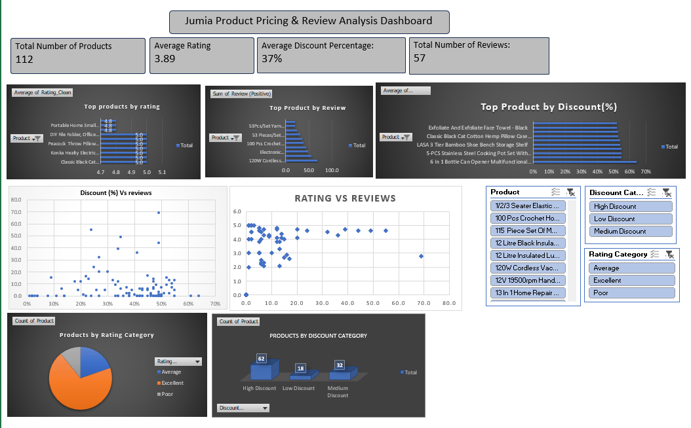

# Jumia Product Pricing & Ratings Analysis (Excel Project)

## Project Overview
This project explores a Jumia product dataset using Microsoft Excel to identify patterns between pricing, discounts, product ratings, and customer engagement.

The goal was to clean the dataset, transform inconsistent values, and generate insights that could support business decision-making in an e-commerce environment.

## Tools Used
- Microsoft Excel
- Data Cleaning Techniques
- Pivot Tables
- Calculated Columns
- Data Visualization (Charts & Dashboard)

## Data Cleaning Steps
- Removed formatting inconsistencies in price columns
- Converted price ranges into usable numeric values
- Handled missing ratings and review values
- Created discount amount and discount category columns
- Standardized rating formats for analysis

## Analysis Performed
- Compared discount levels across products
- Analyzed relationships between ratings and pricing
- Grouped products into discount categories
- Explored customer engagement patterns using reviews
- Built pivot tables for trend identification

## Key Insights
- Medium discount ranges showed stronger engagement patterns
- Higher-rated products were not always the most discounted
- Pricing structure influenced customer interaction levels

## Files Included
jumia_analysis.xlsx – cleaned dataset and analysis workbook
dashboard_preview.png – summary dashboard visualization

## Project Objective
To demonstrate practical Excel-based data cleaning, transformation, and exploratory analysis skills using a real-world e-commerce dataset.

# Dashboard Preview 
